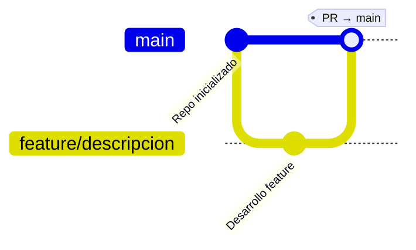
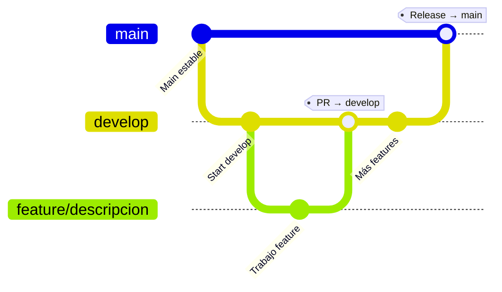
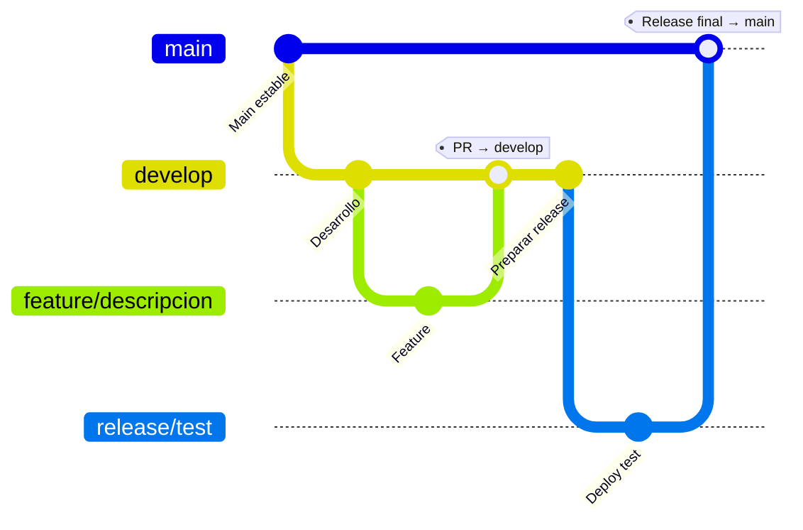

# 🚀 Workflow y Tech Stack – Domus.club

## 🌐 Dominio
**domus.club** – Plataforma integral para la gestión de residenciales y complejos comerciales.
---
## [Ports](/ports.md)
---

## 🧱 Tech Stack

### 🔹 Frontend (Mobile App)
| Capa                | Elección                                                             | Motivo clave |
|---------------------|----------------------------------------------------------------------|--------------|
| **Runtime**         | **Expo SDK 51** (React Native 0.73 + TypeScript)                     | Compilaciones OTA y EAS sin toolchain nativo pesado. |
| **UI Kit**          | **shadcn/ui RN** + **NativeWind**                                    | Consistencia visual estilo Tailwind. |
| **Routing**         | **expo‑router**                                                     | Deep links, enrutado web, navegación declarativa. |
| **State/Data**      | **TanStack Query** (caché) + **Zustand** (estado global ligero)      | Sin boilerplate, SSR‑ready. |
| **Auth (cliente)**  | **expo‑auth‑session** + JWT y API Key en SecureStore                | Permite alternar encabezados `Authorization` y `X‑API‑KEY`. |
| **Push**            | **expo‑notifications** ➜ **Firebase Cloud Messaging**               | Manejo de permisos, tokens y tareas background. |

### 🔹 Backend (Microservicios)
| Componente  | Stack / Librería | Puntos clave de implementación |
|-------------|------------------|-------------------------------|
| **Core API** | **Spring Boot 3.3** con virtual threads (Project Loom) | + Throughput, – RAM. |
| **Seguridad** | **Spring Security 6** + JWT (RS256) y **API Key** | Filtro `OncePerRequestFilter` (JWT) → `ApiKeyFilter` (header `X‑API‑KEY` contra Redis/Vault). Roles propagados en headers Kafka. |
| **Rate‑Limit** | **bucket4j‑spring‑boot‑starter** + **Redis 7** | Límite por JWT, API Key o IP anónima. |
| **Mensajería** | **Apache Kafka 3.7** + spring‑kafka | Esquemas Avro registrados en **Karapace**. |
| **Base de datos** | **PostgreSQL 16** + **Flyway** | Particionado por tenant; WAL‑G backups. |
| **Cache/Sesión** | **Redis 7** | Namespacing por microservicio. |
| **Almacenamiento** | **MinIO / S3 (Contabo)** | Presigned URLs, versión de objetos. |
| **Push** | **Firebase Admin SDK** | Persistencia de `registrationToken`. |
| **WhatsApp/SMS** | **Twilio Programmable Messaging** | Webhooks ↔ Kafka para recibos de entrega. |
| **Correo** | **Spring Mail** (SMTP Mailcow/SES) | DKIM/SPF/DMARC configurados. |

### 🔹 Observabilidad & DevOps
- **Micrometer ➜ Prometheus** para métricas de aplicación.
- **OpenTelemetry Java 1.31 ➜ Tempo 2.5** con `service‑graphs` y `span‑metrics`.
- **Grafana 11** dashboards listos para API latency, Kafka lag, Redis rate‑limit buckets.
- **Loki 3 + Promtail** para logs agragados.
- **Docker Engine 25** + **Docker Swarm** (overlay nets `domus_front`, `domus_back`).
- **Traefik 3** (reverse proxy / LB) en puerto 8671 (compartido con Eureka).
- **Jenkins multibranch** para CI/CD: build Maven (`-DskipTests`), análisis Trivy + OWASP DC, `docker buildx bake`, push, `docker stack deploy`.

---

## 🐳 Docker Swarm
1. **Desarrollo local**  
   ```bash
   docker compose -f docker-compose.dev.yml up
   # Servicios: postgres, redis, kafka, minio, prometheus, tempo, grafana
   ```
2. **Producción** – `docker stack deploy -c stack.yml domus`  
   - Redes: `domus_front` (Traefik 3), `domus_back` (microservicios + Kafka).  
   - Secrets/configs: llave JWT, creds Twilio/Firebase, `otel-collector.yaml`.  
   - **Flyway init** como servicio one‑shot (`--restart-condition=none`).
3. **Rolling updates**: `--update-parallelism 2 --update-delay 30s`.

---

## 🛠️ CI/CD (backend + infra)
| Stage            | Herramienta | Highlights |
|------------------|-------------|------------|
| **Build & Push** | Jenkinsfile | `mvn clean install -DskipTests` → `docker buildx bake` → push. |
| **Security**     | Trivy + OWASP Dependency‑Check | Falla si severidad ≥ HIGH. |
| **Deploy**       | Jenkins + Swarm | Estrategia canary / blue‑green.

### 💡 Notas rápidas
- **ApiKeyFilter**: guarda API Keys en Redis con TTL renovable; etiqueta por plan para límites diferenciados.
- Swagger UI declara `bearerAuth` + `apiKeyDomus` en `securitySchemes`.
- **Expo OTA** sirviéndose desde S3/CloudFront.
- **Backups**: WAL‑G (Postgres) + snapshots diarios de MinIO.

---

## 📁 Estructura de Repositorios (Multi‑repo)
```text
domus-backend-auth-service
... (otros microservicios)
domus-backend-api-gateway

domus-frontend-mobile-app   # Expo

domus-docker               # Docker Compose / Swarm
-domus-database             # Migraciones Flyway
-domus-infra                # IaC (Terraform/Ansible)
```
> **Convención:** `domus-backend-<service-name>`.

---

## 🔁 Gitflow – Fases
### 🧩 Fase 1 – Inicial (feature → main)

### 🧩 Fase 2 – Standard Gitflow (develop → main)

### 🧩 Fase 3 – Environments (Testing & Prod)

- **test.domus.club** – deploy automático (branch `release/test`).
- **domus.club** – deploy manual tras QA.

---

## 📛 Convenciones de Nombres
| Tipo                 | Convención                          | Ejemplo                           |
|----------------------|-------------------------------------|-----------------------------------|
| Repositorio          | `domus-backend-<service-name>`      | `domus-backend-alert-service`     |
| Imagen Docker        | `domus/<service>:<build>`           | `domus/user-service:101`          |
| Jenkins Pipeline     | `CI-<service-name>`                 | `CI-domus-backend-user-service`   |
| Dominio Staging      | `test.domus.club`                   | `test-api.domus.club`             |
| Dominio Producción   | `domus.club`                        | `api.domus.club`                  |

---

## 📚 Documentación
*(enlaces oficiales con URL)*

### Frontend
| Tema | URL |
|------|-----|
| **Expo SDK** | <https://docs.expo.dev/> |
| **React Native** | <https://reactnative.dev/docs/getting-started> |
| **shadcn/ui (web)** | <https://ui.shadcn.com/> |
| **shadcn/ui RN port** | <https://github.com/callstack/shadcn-ui-react-native> |
| **NativeWind** | <https://www.nativewind.dev/> |
| **TanStack Query** | <https://tanstack.com/query/latest/docs/react-native> |
| **Zustand** | <https://docs.pmnd.rs/zustand/getting-started/introduction> |
| **expo‑router** | <https://expo.github.io/router/docs> |
| **expo‑auth‑session** | <https://docs.expo.dev/versions/latest/sdk/auth-session/> |
| **expo‑notifications** | <https://docs.expo.dev/versions/latest/sdk/notifications/> |
| **Firebase Cloud Messaging** | <https://firebase.google.com/docs/cloud-messaging> |

### Backend
| Tema | URL |
|------|-----|
| **Spring Boot** | <https://docs.spring.io/spring-boot/docs/current/reference/html/> |
| **Spring Security** | <https://docs.spring.io/spring-security/reference/> |
| **bucket4j** | <https://github.com/bucket4j/bucket4j> |
| **Redis** | <https://redis.io/docs/> |
| **Apache Kafka** | <https://kafka.apache.org/documentation/> |
| **Spring for Apache Kafka** | <https://docs.spring.io/spring-kafka/docs/current/reference/html/> |
| **PostgreSQL** | <https://www.postgresql.org/docs/> |
| **Flyway** | <https://flywaydb.org/documentation/> |
| **AWS S3 (Java SDK)** | <https://docs.aws.amazon.com/sdk-for-java/latest/developer-guide/examples-s3.html> |
| **MinIO (Java SDK)** | <https://docs.min.io/docs/java-client-quickstart-guide.html> |
| **Firebase Admin SDK (Java)** | <https://firebase.google.com/docs/admin/setup> |
| **Twilio Programmable Messaging** | <https://www.twilio.com/docs/sms> |
| **Micrometer** | <https://micrometer.io/docs> |
| **Prometheus** | <https://prometheus.io/docs/introduction/overview/> |
| **OpenTelemetry Java** | <https://opentelemetry.io/docs/instrumentation/java/> |
| **Grafana** | <https://grafana.com/docs/> |
| **Tempo** | <https://grafana.com/docs/tempo/latest/> |
| **Loki** | <https://grafana.com/docs/loki/latest/> |
| **Docker** | <https://docs.docker.com/> |
| **Docker Swarm** | <https://docs.docker.com/engine/swarm/> |
| **Traefik 3** | <https://doc.traefik.io/traefik/v3.0/> |
| **Vault** | <https://developer.hashicorp.com/vault/docs> |
| **Spring Cloud Config** | <https://docs.spring.io/spring-cloud-config/docs/current/reference/html/> |
| **Karapace Schema Registry** | <https://github.com/aiven/karapace#karapace> |
| **Jenkins Pipeline** | <https://www.jenkins.io/doc/book/pipeline/> |
