# 🚀 Workflow and Tech Stack - Resicue.com

## 🌐 Domain
**resicue.com** – Management platform for residences and commercial spaces.

---

## 🧱 Tech Stack

### 🔹 Frontend
- **Expo (React Native)** for cross-platform mobile development.
- Integration with REST APIs.
- Push notifications support (via Firebase).
- State management: Context API or Redux (based on growth).

### 🔹 Backend
- **Spring Boot 3+**
- **Spring Cloud**
- **Spring Security** with JWT.
- **Eureka Service Discovery** for microservice registration.
- **Apache Kafka** for asynchronous communication.
- **PostgreSQL** as the main relational database.
- **Redis** for caching and session management.
- **Firebase** for push notifications.
- **Contabo** as server provider and S3-compatible storage.
- **Payment gateways:** CyberSource (BAC and Lafise under evaluation).
- **Docker** for containerization.
- **Prometheus + Grafana** for monitoring and metrics.
- **Swagger/OpenAPI** for API documentation.
- **Promtail/Loki** for logs.
- **Jenkins** for CI/CD (pipeline per microservice).

---

## 📁 Project Structure

### 🔸 Repositories (Multi-repo)
Each microservice has its own dedicated repository:

```
resicue-auth-service
resicue-user-service
resicue-access-control-service
resicue-visit-history-service
resicue-alert-service
resicue-communication-service
resicue-survey-service
resicue-ownership-service
resicue-reservation-service
resicue-finance-service
resicue-delinquency-tracker
resicue-financial-reports
resicue-support-ticketing
resicue-support-chat
resicue-knowledge-base
resicue-api-gateway
resicue-mobile-app (Expo)
```

---

## 🔁 Gitflow: Phases

### 🧩 Phase 1: Initial (feature → main)


**Best practices:**
- Each feature in its own branch: `feature/name`.
- Mandatory code reviews (PRs).
- CI runs tests before merging.
- Manual deploy after merging to `main`.

---

### 🧩 Phase 2: Standard Gitflow (develop → main)

```mermaid
gitGraph
    commit id: "Stable main"
    branch develop
    commit id: "Start develop"
    branch feature/description
    commit id: "Developing feature"
    checkout develop
    merge feature/description tag: "PR → develop"
    commit id: "More features"
    checkout main
    merge develop tag: "Release → main"
```



**Best practices:**
- All `feature/*` branches are merged into `develop`.
- `develop` is merged into `main` for releases.
- Semantic versioning tags: `v1.0.0`, `v1.1.0`.
- Automatic testing in every PR.

---

### 🧩 Phase 3: Testing and Production Environments


**Environments:**
- **test.resicue.com** (Staging environment).
- **resicue.com** (Production).

**Best practices:**
- `release/test` is auto-deployed to the test environment.
- Manual validation (QA).
- Logs and monitoring must be accessible for debugging.

---

## 📛 Naming Conventions

| Type               | Convention                        | Example                              |
|--------------------|------------------------------------|--------------------------------------|
| Repository         | `resicue-<service-name>`           | `resicue-alert-service`              |
| Docker Image       | `resicue/<service>:<build>`        | `resicue/user-service:101`           |
| Jenkins Pipeline   | `CI-<service-name>`                | `CI-resicue-user-service`            |
| Staging Domain     | `test.resicue.com`                 | `test-api.resicue.com`               |
| Production Domain  | `resicue.com`                      | `api.resicue.com`                    |
