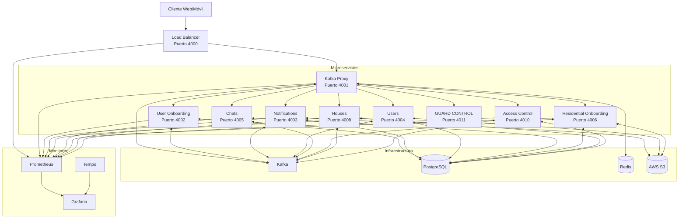
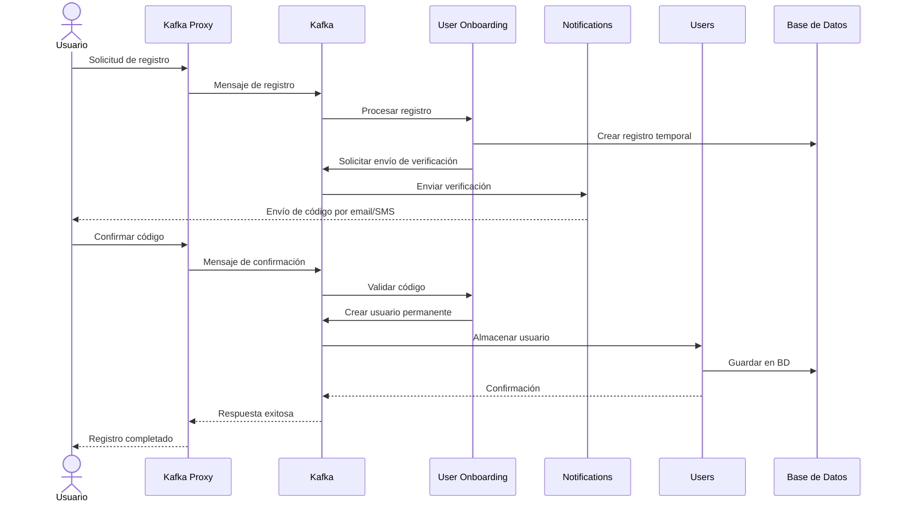
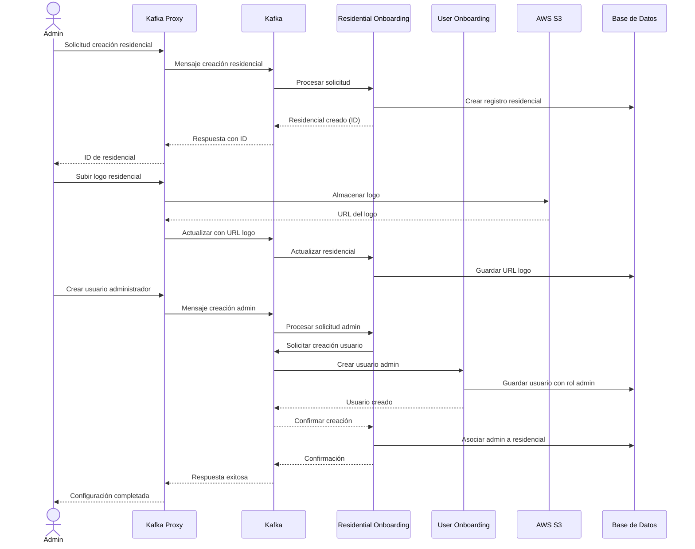
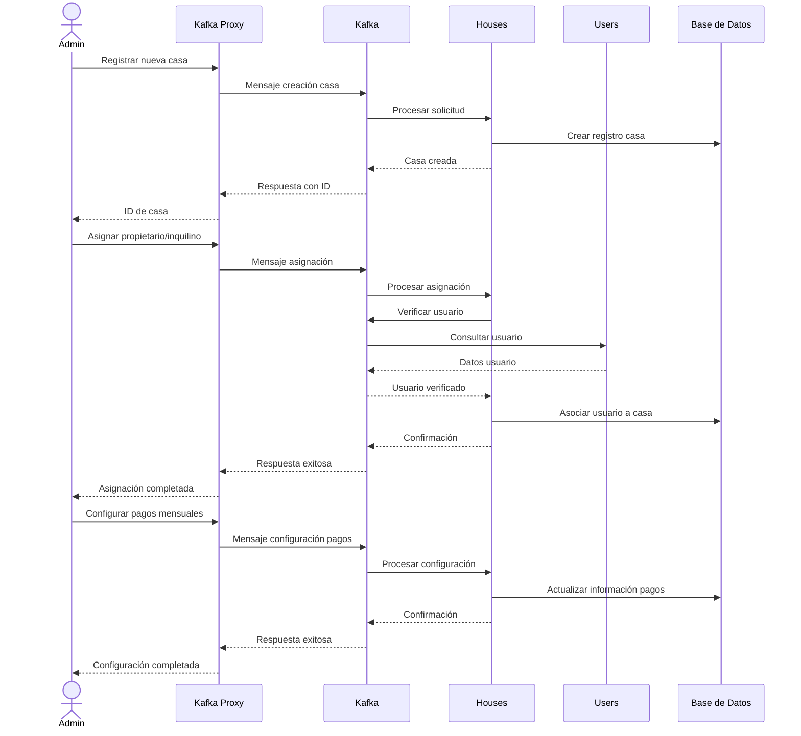
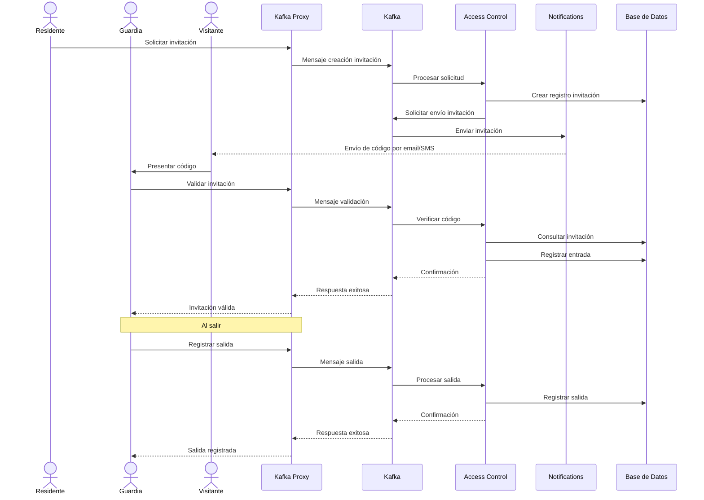
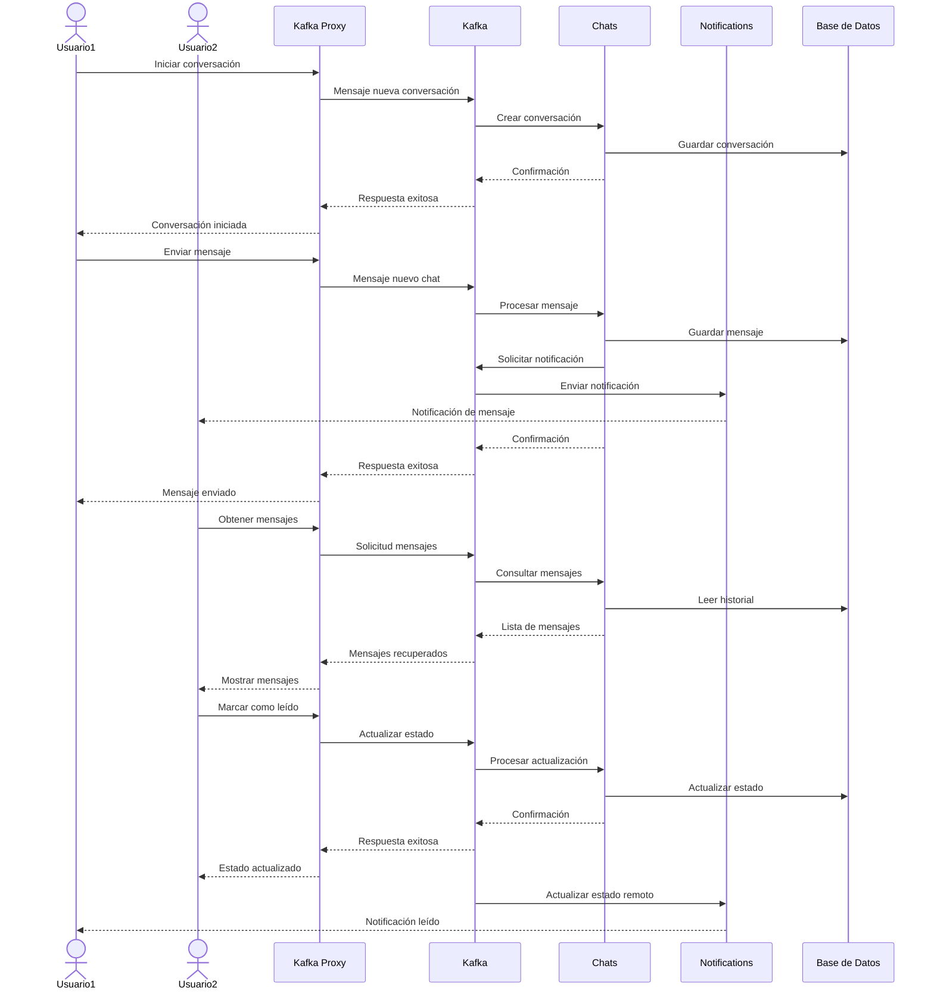

# Documentación de Microservicios - Domus

## Descripción General

Domus es una plataforma para la gestión de residenciales que utiliza una arquitectura de microservicios para proporcionar distintas funcionalidades. El sistema está construido con tecnologías como Java 21, Spring Boot, Kafka para comunicación asíncrona, y se implementa en contenedores Docker usando Docker Swarm.

## Arquitectura del Sistema

La arquitectura de Domus se compone de los siguientes componentes principales:

- **Microservicios especializados**: Cada microservicio se encarga de una responsabilidad específica
- **Kafka**: Bus de eventos para la comunicación asíncrona entre microservicios
- **Proxy API**: Gateway centralizado que dirige las peticiones a los microservicios correspondientes
- **Monitorización**: Prometheus, Grafana y Tempo para observabilidad
- **Base de datos**: PostgreSQL para persistencia de datos

### Diagrama de Arquitectura

## Microservicios

### Load Balancer (Puerto: 4000)

Actúa como puerta de entrada principal al sistema, redirigiendo el tráfico a los microservicios correspondientes.

**Responsabilidades:**
- Balanceo de carga entre instancias de microservicios
- Enrutamiento de solicitudes HTTP
- Punto único de entrada para las aplicaciones cliente

### Kafka Proxy (Puerto: 4001)

Actúa como proxy API para los demás microservicios, encapsulando la lógica de comunicación vía Kafka.

**Responsabilidades:**
- Exponer endpoints REST para interactuar con todos los microservicios
- Traducir peticiones HTTP a mensajes Kafka
- Gestionar respuestas asíncronas y devolverlas al cliente

### User Onboarding (Puerto: 4002)

Gestiona el proceso de registro e incorporación de nuevos usuarios al sistema.

**Responsabilidades:**
- Registro de nuevos usuarios
- Validación de información de usuario
- Proceso de activación de cuentas

**Flujo principal:**
1. Registro inicial de usuario con datos básicos
2. Validación de correo electrónico/teléfono
3. Asignación de rol y permisos iniciales

### Notifications (Puerto: 4003)

Gestiona el envío de notificaciones a usuarios a través de diferentes canales.

**Responsabilidades:**
- Enviar notificaciones por email
- Enviar notificaciones por SMS
- Enviar notificaciones por WhatsApp
- Gestionar plantillas de notificaciones

**Canales soportados:**
- Email (mediante servicio de correo configurado)
- SMS (mediante Twilio)
- WhatsApp (mediante Twilio)

### Users (Puerto: 4004)

Gestiona la información y operaciones relacionadas con usuarios existentes.

**Responsabilidades:**
- Gestión de perfiles de usuario
- Autenticación y autorización
- Actualización de información personal
- Cambio de contraseñas y recuperación de cuentas

### Chats (Puerto: 4005)

Gestiona la comunicación entre usuarios dentro del sistema.

**Responsabilidades:**
- Mensajería instantánea entre usuarios
- Grupos de chat para residenciales
- Historial de conversaciones
- Notificaciones de mensajes nuevos

### Residential Onboarding (Puerto: 4006)

Gestiona el proceso de registro e incorporación de nuevos residenciales al sistema.

**Responsabilidades:**
- Registro de nuevos residenciales
- Configuración inicial de residenciales
- Asignación de administradores

**Flujo principal:**
1. Registro del residencial con información básica
2. Carga de logo e imágenes del residencial
3. Creación de usuario administrador para el residencial

### Houses (Puerto: 4008)

Gestiona la información y operaciones relacionadas con las casas/unidades dentro de los residenciales.

**Responsabilidades:**
- Registro de casas en residenciales
- Asignación de propietarios/inquilinos
- Gestión de información específica de cada casa
- Control de pagos mensuales y estado financiero

### Access Control (Puerto: 4010)

Gestiona el control de acceso a residenciales mediante invitaciones y permisos.

**Responsabilidades:**
- Generación de invitaciones para visitantes
- Validación de invitaciones en puntos de acceso
- Registro de entradas y salidas
- Permisos especiales para proveedores de servicios

**Flujo de invitación:**
1. Residente genera una invitación para visitante
2. Se envía notificación al visitante
3. Guardia valida invitación en entrada
4. Sistema registra entrada y salida

### Config Server (Puerto: 4400)

Gestiona la configuración centralizada para todos los microservicios.

**Responsabilidades:**
- Proveer configuración centralizada a microservicios
- Actualización dinámica de configuraciones
- Gestión de perfiles de configuración por ambiente

## Flujos de Trabajo Principales

### Registro de Usuario

1. Cliente envía petición de registro al Kafka Proxy
2. Kafka Proxy envía mensaje al User Onboarding
3. User Onboarding procesa registro y solicita envío de verificación
4. Notifications envía código de verificación
5. Usuario confirma código y completa registro
6. Users almacena información permanente del usuario

### Registro de Residencial

1. Cliente envía petición de registro de residencial al Kafka Proxy
2. Kafka Proxy envía mensaje al Residential Onboarding
3. Residential Onboarding registra información básica del residencial
4. Se registra usuario administrador del residencial
5. Se configura el residencial con opciones iniciales

### Registro de Casa

1. Administrador de residencial registra nueva casa
2. Se asigna identificador único a la casa
3. Se pueden registrar propietarios/inquilinos
4. Se configura información de pagos mensuales

### Creación de Invitación

1. Residente solicita creación de invitación para visitante
2. Access Control genera código único de invitación
3. Notifications envía invitación al visitante
4. Guardia valida invitación en entrada
5. Sistema registra entrada y salida

### Comunicación vía Chat

1. Usuario inicia conversación con otro usuario o grupo
2. Chats gestiona el envío y recepción de mensajes
3. Notifications envía alertas de nuevos mensajes
4. Se mantiene historial de conversaciones

## Tecnologías Utilizadas

- **Lenguaje**: Java 21
- **Framework**: Spring Boot, Spring MVC, Spring Data JPA
- **Mensajería**: Apache Kafka
- **Base de Datos**: PostgreSQL
- **Contenedores**: Docker, Docker Swarm
- **Monitorización**: Prometheus, Grafana, Tempo, Loki
- **CI/CD**: Jenkins Pipeline
- **Almacenamiento**: AWS S3
- **Notificaciones**: Twilio, SMTP

## Monitorización y Observabilidad

Todos los microservicios exponen métricas a través de Prometheus en el endpoint `/actuator/prometheus`. Estas métricas son recopiladas y visualizadas en dashboards de Grafana para monitoreo en tiempo real.

La trazabilidad distribuida se implementa con OpenTelemetry y Tempo, permitiendo seguir el flujo de una solicitud a través de todos los microservicios involucrados.

## Seguridad

La seguridad se implementa a través de:

- Autenticación basada en tokens JWT
- Comunicación cifrada entre microservicios
- Validación de entradas en todos los endpoints
- Gestión centralizada de secretos
- Control de acceso basado en roles
